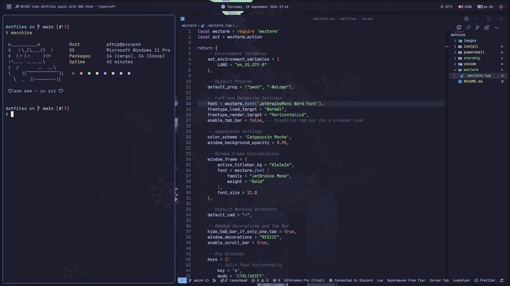

# Pyyupsk's Windots 🚀

Welcome to **Pyyupsk's Windots repository**! This project is designed to automate and streamline the process of setting up a modern development environment on **Windows**, specifically for developers who want an efficient, customizable, and powerful setup.

## 🌟 Key Features

- **Automated Setup**: Quickly install and configure your development environment with a single PowerShell script.
- **Custom Configurations**: Pre-configured terminal emulator, prompt, code editor, and more.

## 🛠️ Prerequisites

Before running the installation, make sure you have the following installed:

- [Git](https://git-scm.com/) for cloning the repository.
- [PowerShell](https://docs.microsoft.com/en-us/powershell/) to run the installation scripts.

## ⚡ Quick Start

1. **Clone the repository** to your local machine:

   ```powershell
   git clone https://github.com/pyyupsk/windots.git
   cd windots
   ```

2. **Run the installation script** to set up your environment:

   ```powershell
   .\install\install.ps1
   ```

   This will install tools, set up configuration files, and run any necessary post-installation steps.

3. **Start using your newly configured environment**!

   You can now enjoy a modern, efficient, and powerful development setup tailored to your workflow.

## 💻 My Setup

Here are the details of the tools and environment configurations I use:

- **Operating System**: Windows 11 💻
- **Window Manager**: [GlazeWM](https://github.com/glzr-io/glazewm) (Tiling Window Manager for efficient window handling)
- **Shell**: PowerShell
- **Terminal**: [WezTerm](https://wezfurlong.org/wezterm/) (GPU-accelerated cross-platform terminal)
- **Editor**: [Visual Studio Code](https://code.visualstudio.com/) (Lightweight and powerful source code editor)
- **Prompt**: [Starship](https://starship.rs/) (Minimal, fast cross-shell prompt)
- **Status Bar**: [Yasb](https://github.com/amnweb/yasb) (Yet Another Status Bar)
- **File Manager**: [Yazi](https://github.com/sxyazi/yazi) (a blazing fast terminal file manager)
- **Launcher**: [Flow Launcher](https://flowlauncher.com/) (a fast and customizable application launcher)

## Keybindings

Here's a quick reference for the keybindings used across different tools:

### GlazeWM (Window Manager)

- `Alt + [H,J,K,L]` or `Alt + Arrow Keys`: Focus window in direction
- `Alt + Shift + [H,J,K,L]` or `Alt + Shift + Arrow Keys`: Move window in direction
- `Alt + [U,I,O,P]`: Resize window
- `Alt + R`: Enter resize mode (use `H,J,K,L` or arrow keys to resize)
- `Alt + V`: Change tiling direction
- `Alt + Space`: Cycle focus between tiling, floating, and fullscreen
- `Alt + Shift + Space`: Change focused window to floating
- `Alt + T`: Toggle tiling
- `Alt + F`: Toggle fullscreen
- `Alt + M`: Minimize window
- `Alt + Q`: Close window
- `Alt + Shift + E`: Exit GlazeWM
- `Alt + Shift + R`: Reload config
- `Alt + Shift + W`: Redraw all windows
- `Alt + Enter`: Launch terminal
- `Alt + B`: Launch browser
- `Alt + F`: Launch file explorer
- `Alt + C`: Launch code editor
- `Alt + S`: Focus next workspace
- `Alt + A`: Focus previous workspace
- `Alt + [1-9]`: Switch to workspace
- `Alt + Shift + [1-9]`: Move window to workspace

### WezTerm (Terminal)

- `Ctrl + Shift + S`: Split pane horizontally
- `Ctrl + Alt + S`: Split pane vertically
- `Ctrl + Shift + Arrow Keys`: Resize panes
- `Ctrl + [H,J,K,L]`: Navigate between panes
- `Ctrl + Shift + W`: Close pane
- `Ctrl + Shift + B/F`: Scroll up/down
- `Ctrl + Z`: Toggle pane zoom
- `Ctrl + Shift + U`: Quick select mode

### VSCode (Editor)

- `Ctrl + T`: Toggle terminal
- `Ctrl + Shift + T`: Split terminal
- `Ctrl + Shift + F`: Format document
- `Ctrl + Shift + /`: Block comment
- `Ctrl + Shift + Enter`: Go to definition
- `Ctrl + Tab`: Next editor
- `Ctrl + Shift + Tab`: Previous editor
- `Ctrl + E`: Quick open
- `Ctrl + Shift + E`: Toggle explorer
- `Ctrl + F`: Find in file
- `Ctrl + N`: New file
- `Ctrl + Shift + N`: New folder
- `F11`: Toggle zen mode

### PowerShell Aliases

- `la`: List all files with details
- `ll`: List files in tree format
- `lla`: List all files in tree format
- `l`: List files with details
- `nf`: Create new file
- `nd`: Create new directory
- `rm`: Remove item
- `rmrf`: Force remove item recursively
- `c`: Clear screen
- `dev`: Navigate to projects directory
- `code`: Open VSCode
- `kill-port`: Kill process on specified port
- `ff`: Fuzzy find files
- `fdir`: Fuzzy find directories
- `fexe`: Fuzzy find executables
- `bf`: Fuzzy find with bat preview

Git aliases:

- `gs`: Git status
- `ga`: Git add
- `gaa`: Git add all
- `gcl`: Git clone

Docker aliases:

- `dps`: Docker ps
- `dimg`: Docker images
- `dexec`: Docker exec
- `dc`: Docker compose

## Screenshots

Check out how the environment looks in action:



## 📝 Troubleshooting

If you encounter any issues during installation or setup, here are a few tips:

- **Script Execution Policy**: Make sure your PowerShell script execution policy allows the running of local scripts. You may need to run the following command:

   ```powershell
   Set-ExecutionPolicy RemoteSigned -Scope CurrentUser
   ```

- **Permissions**: Ensure you are running PowerShell as Administrator if some parts of the script require elevated permissions.
- **Dependencies**: Check that Git and PowerShell are properly installed and available in your system's PATH.

### 🛠️ Contributing

Contributions are welcome! If you'd like to contribute, please follow these steps:

1. Fork the repository.
2. Create a new feature branch (`git checkout -b feature-branch`).
3. Make your changes and test thoroughly.
4. Submit a pull request.

## 📬 Contact

For any questions, suggestions, or feedback, feel free to reach out:

- Email: [pyyupsk@proton.me](mailto:pyyupsk@proton.me)

## 📄 License

This repository is licensed under the [MIT License](LICENSE). Feel free to fork, modify, and use it for your personal or professional projects.

## 🎉 Acknowledgements

Thanks to the open-source community for providing such powerful tools and resources!
